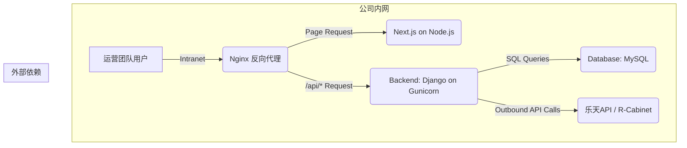
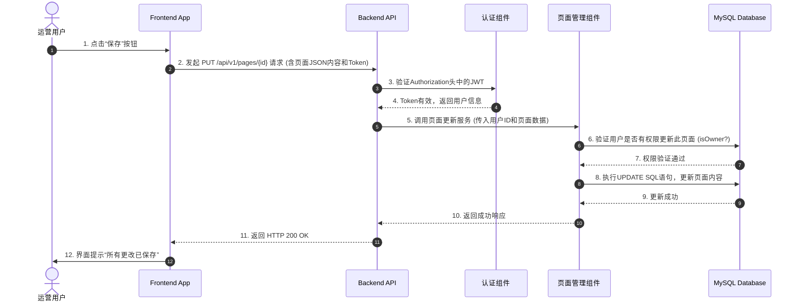
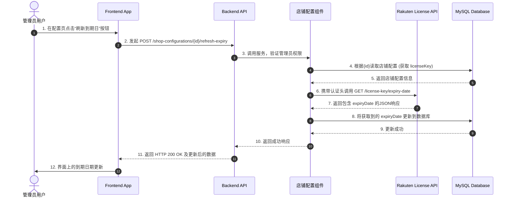

# Pagemaker 全栈架构文档

## 第一部分：引言 (Introduction)

本文档概述了 **Pagemaker** 项目的完整全栈架构，包括后端系统、前端实现及其集成方式。它将作为AI驱动开发过程中唯一的、权威的技术真实来源，确保整个技术栈在开发过程中的一致性。这份统一的架构文档结合了传统上分离的后端和前端架构，旨在为现代全栈应用的开发流程提供便利。

### 启动模板或生成策略 (Starter Template or Generation Strategy)

根据PRD的规划，本项目属于“绿地 (Greenfield)”项目，但其前端部分的初始结构将采用一种AI辅助的生成策略。

* **前端生成工具**: 前端UI的初步脚手架将主要依赖 **v0.dev** 工具来生成。
* **基础技术栈**: v0.dev将生成一个基于 **Next.js 15.3** 框架、使用 **shadcn/ui** 和 **Tailwind CSS** 的项目结构。
* **验证步骤**: 项目的初始阶段（Epic 0）包含一个专门的用户故事（Story 0.6），用于验证v0.dev生成代码的质量、可维护性及集成兼容性，以确保此策略的可行性。

---

## 第二部分：高阶架构 (High Level Architecture)

### 2.1 技术摘要 (Technical Summary)

Pagemaker项目将采用现代化的 **前后端分离** 架构。前端将使用 **Next.js** 框架构建，并利用 **v0.dev** 进行UI的初步生成和快速迭代；后端则采用 **Python Django** 框架提供强大的API服务和业务逻辑支持。项目代码将统一管理在 **Monorepo** 代码库中，以提升开发和维护效率。整体架构旨在实现高效开发、关注点分离和未来的可扩展性。

### 2.2 平台与基础设施选择 (Platform and Infrastructure Choice)

* **开发环境 (Development Mode):**
    * **目标:** 快速迭代，实时预览。
    * **前端部署:** 通过 **GitHub Actions 自动部署到 Vercel 平台**。
    * **后端部署:** 公司已购买的**云服务器**。

* **生产环境 (Production Mode):**
    * **目标:** 最大化保障数据安全。
    * **部署平台:** 公司**内网服务器 (On-Premise)**。
    * **前端部署方式:** 在内网服务器上，我们将搭建一个 **Node.js** 运行环境，并通过 **PM2** 等进程管理器来运行Next.js应用。
    * **后端部署方式:** 使用 **Gunicorn** 作为WSGI服务器来运行Django应用。
    * **流量分发与整合:** 为了让前后端在内网中无缝协作，我们将使用 **Nginx** 作为反向代理。Nginx将负责接收所有请求，将针对前端页面的请求转发给Node.js进程，将API请求（如 `/api/*`）转发给Gunicorn/Django进程。

### 2.4 高阶架构图 (High Level Architecture Diagram)

此图仅展示**生产环境**下的架构：


### 2.5 架构模式 (Architectural Patterns)

为确保我们的系统设计清晰、易于维护和扩展，我们将遵循以下核心架构模式：

* **前后端分离 (Frontend-Backend Split)**: 明确分离UI渲染和业务逻辑，允许两端独立开发、部署和扩展。
* **BFF (Backend for Frontend)**: Django后端将作为专门服务于Next.js前端的BFF，提供量身定制的API接口，简化前端数据处理。
* **组件化UI (Component-Based UI)**: 前端将严格遵循组件化的开发模式，利用 `shadcn/ui` 构建可复用、独立的UI单元。
* **仓库模式 (Repository Pattern)**: 在Django后端，我们将采用仓库模式来封装数据访问逻辑，将业务逻辑与数据库操作解耦，便于测试和未来的数据源更换。

---

## 第三部分：技术栈 (Tech Stack)

| 类别 | 技术 | 版本 | 用途 | 理由 |
| :--- | :--- | :--- | :--- | :--- |
| **前端语言** | TypeScript | `~5.x` | 类型安全的前端开发 | 与后端共享类型，代码更健壮 |
| **前端框架** | Next.js | `15.3` | React框架，支持多种渲染模式 | Vercel原生支持，性能优异 |
| **UI组件库** | shadcn/ui | `2.6` | UI基础组件 | 灵活、可访问性好，与v0.dev兼容 |
| **CSS框架** | Tailwind CSS | `4.1` | 功能类优先的CSS框架 | 开发效率高，定制性强 |
| **前端Hooks库** | ahooks | `~3.x` | 便捷的React Hooks集合 | 提供了许多实用的封装 |
| **后端语言** | Python | `~3.12` | 后端业务逻辑 | 团队熟悉度高，生态成熟 |
| **后端框架** | Django | `~5.1` | 全功能Web框架 | 开发效率高，内置功能丰富 |
| **API风格** | REST | `DRF ~3.15` | 前后端数据交互接口 | 成熟稳定，生态广泛 |
| **数据库** | MySQL | `8.4+` | 主数据存储 | 团队熟悉，性能可靠 |
| **前端测试** | Vitest | `~3.2.4` | UI组件和逻辑单元测试 | 现代、快速的测试框架，与Vite生态兼容，API与Jest类似，上手快。 |
| **后端测试** | Pytest | `~8.2` | 后端单元和集成测试 | 功能强大，插件丰富 |
| **CI/CD** | GitHub Actions| `v4` | 自动化构建、测试、部署 | 与代码库无缝集成 |
| **IaC工具** | Terraform | `~1.8` | 基础设施即代码 | 行业标准，声明式语法清晰，能有效管理和版本化云资源。 |
| **日志** | Pino (前端), Python Logging (后端) | `~9.1` / (内置) | 应用日志收集与分析 | Pino轻量且性能高；Python内置logging功能强大，可配置输出JSON格式，便于后续分析。 |
| **监控** | Prometheus + Grafana | (最新稳定版) | 系统性能与健康度监控 | 强大的开源监控黄金组合，提供灵活的数据采集、查询和丰富的可视化仪表盘。 |

## 第四部分：数据模型 (Data Models)

#### 模型 1: PageTemplate (页面/模板)

* **用途 (Purpose):** 代表一个由运营用户在Pagemaker中创建的可视化页面或可复用的布局模板。
* **核心属性 (Key Attributes):**
    * `id`: `UUID` - 唯一标识符 (主键)。
    * `name`: `String` - 用户为页面或模板设定的名称。
    * `content`: `JSON` - 核心字段，用于存储构成页面的所有模块及其配置的结构化JSON数据。
    * `target_area`: `String` - 关联的乐天“目标区域”，用于标识此页面的用途。
    * `owner_id`: `ForeignKey` - 关联到创建此页面的用户。
    * `created_at`: `DateTime` - 创建时间戳。
    * `updated_at`: `DateTime` - 最后修改时间戳。
* **TypeScript 接口 (共享于 `packages/shared-types`):**
    ```typescript
    interface PageModule {
      id: string; // 模块实例的唯一ID
      type: 'title' | 'text' | 'image' | 'separator' | 'keyValue' | 'multiColumn'; // 模块类型
      [key: string]: any; // 其他配置属性
    }

    interface PageTemplate {
      id: string;
      name: string;
      content: PageModule[];
      targetArea: string;
      ownerId: string;
      createdAt: string; // ISO 8601 Date String
      updatedAt: string; // ISO 8601 Date String
    }
    ```
* **关系 (Relationships):**
    * **多对一 (Many-to-One):** 多个`PageTemplate`可以属于一个`User` (用户)。

#### 模型 2: User (用户)

* **用途 (Purpose):** 代表一个Pagemaker CMS系统的认证用户。每个用户都可以登录系统、创建和管理属于自己的页面/模板。
* **核心属性 (Key Attributes):**
    * `id`: `UUID` - 唯一标识符 (主键)。
    * `username`: `String` - 用于登录系统的唯一用户名。
    * `password`: `String` - 经过哈希加密的用户密码。
    * `email`: `String` - 用户的电子邮箱，可用于未来的通知功能。
    * `full_name`: `String` - 用户的全名，用于在界面上显示。
    * `role`: `Enum` - 用户角色。建议预设两个角色：`'editor'` (编辑) 和 `'admin'` (管理员)。
    * `is_active`: `Boolean` - 标记用户账户是否有效，便于禁用账户而非直接删除。
    * `created_at`: `DateTime` - 创建时间戳。
    * `updated_at`: `DateTime` - 最后修改时间戳。
* **TypeScript 接口 (共享于 `packages/shared-types`):**
    ```typescript
    interface User {
      id: string;
      username: string;
      email: string;
      fullName: string;
      role: 'editor' | 'admin';
      isActive: boolean;
      createdAt: string; // ISO 8601 Date String
      updatedAt: string; // ISO 8601 Date String
    }
    ```
* **关系 (Relationships):**
    * **一对多 (One-to-Many):** 一个`User`可以拥有多个`PageTemplate`。

#### 模型 3: ShopConfiguration (店铺配置)

* **用途 (Purpose):** 为每一个独立的店铺或目标区域存储其专属的API和FTP集成凭据，并管理其API密钥的有效期。
* **核心属性 (Key Attributes):**
    * `id`: `UUID` - 唯一标识符 (主键)。
    * `shop_name`: `String` - 用户可识别的店铺名称。
    * `target_area`: `String` (Unique) - 关联到 `PageTemplate` 的`target_area`字段。
    * `api_service_secret`: `EncryptedString` - 加密存储的乐天API Service Secret。
    * `api_license_key`: `EncryptedString` - 加密存储的乐天API License Key。
    * `api_license_expiry_date`: `DateTime` (Nullable) - 从乐天API获取的许可证密钥到期日期。
    * `ftp_host`: `String` - FTP服务器地址。
    * `ftp_port`: `Integer` - FTP服务器端口。(注：FTP的标准端口通常是21)
    * `ftp_user`: `String` - FTP用户名。
    * `ftp_password`: `EncryptedString` - 加密存储的FTP密码。
    * `created_at`: `DateTime` - 创建时间戳。
    * `updated_at`: `DateTime` - 最后修改时间戳。
* **TypeScript 接口 (共享于 `packages/shared-types`):**
    ```typescript
    interface ShopConfiguration {
      id: string;
      shopName: string;
      targetArea: string;
      apiLicenseExpiryDate?: string | null; // ISO 8601 Date String
    }
    ```
* **关系 (Relationships):**
    * **一对一 (One-to-One):** 每个`ShopConfiguration`精确对应一个`target_area`。

---

## 第五部分：组件 (Components)

#### 组件 1: 认证组件 (Authentication Component)

* **职责 (Responsibility):** 全权负责用户身份认证。处理用户登录请求，验证凭据，并生成和刷新用于API访问的JWT（JSON Web Tokens）。
* **关键接口 (Key Interfaces):**
    * `POST /api/auth/token`: 用户登录并获取访问令牌。
    * `POST /api/auth/token/refresh`: 刷新即将过期的访问令牌。
* **依赖 (Dependencies):** `User` 数据模型。
* **技术栈 (Technology Stack):** Django, Django REST Framework, Simple JWT。

#### 组件 2: 页面管理组件 (Page Management Component)

* **职责 (Responsibility):** 负责所有与 `PageTemplate` 相关的CRUD（创建、读取、更新、删除）操作。这是系统的核心业务逻辑所在。
* **关键接口 (Key Interfaces):**
    * `GET /api/v1/pages/`: 获取页面/模板列表。
    * `POST /api/v1/pages/`: 创建一个新的页面/模板。
    * `GET /api/v1/pages/{id}/`: 获取单个页面/模板的详细信息。
    * `PUT /api/v1/pages/{id}/`: 更新一个页面/模板的内容和属性。
    * `DELETE /api/v1/pages/{id}/`: 删除一个页面/模板。
* **依赖 (Dependencies):** `PageTemplate` 和 `User` 数据模型；认证组件 (所有接口都需验证用户身份和权限)。
* **技术栈 (Technology Stack):** Django, Django REST Framework。

#### 组件 3: 媒体集成组件 (Media Integration Component)

* **职责 (Responsibility):** 作为与乐天R-Cabinet交互的唯一代理。处理所有媒体文件（主要是图片）的上传、校验和获取URL的逻辑。
* **关键接口 (Key Interfaces):**
    * `POST /api/v1/media/upload`: 接收前端上传的文件，并将其转发存储到R-Cabinet。
* **依赖 (Dependencies):**
    * 店铺配置组件: 在执行操作前，需根据当前操作的`target_area`，从此组件获取对应的乐天API密钥和FTP凭据。
    * 乐天R-Cabinet API & FTP服务器。
    * 认证组件 (确保只有登录用户才能上传)。
* **技术栈 (Technology Stack):** Django, Python `requests` 库, Python `ftplib` 库。

#### 组件 4: 店铺配置组件 (Shop Configuration Component)

* **职责 (Responsibility):** 提供`ShopConfiguration`模型的CRUD管理功能。此外，它还负责调用乐天API，获取并刷新指定店铺配置中的`licenseKey`的到期日期。
* **关键接口 (Key Interfaces):**
    * `GET /api/v1/shop-configurations/`: 获取所有店铺配置的列表。
    * `PUT /api/v1/shop-configurations/{id}/`: 更新指定店铺的配置信息。
    * `POST /api/v1/shop-configurations/{id}/refresh-expiry`: 触发一个后台任务，调用乐天API来获取并更新该店铺配置的API到期日期。
* **依赖 (Dependencies):** `ShopConfiguration` 数据模型；认证组件；Rakuten License Management API。
* **技术栈 (Technology Stack):** Django, Django REST Framework。

### 组件交互图 (Component Interaction Diagram)

```mermaid
graph TD
    User[运营用户] -->|1. 操作UI| FE[Frontend App (Next.js)];

    subgraph "后端系统 (Django on AWS)"
        FE -->|2. 发起API请求| API_GW[API Gateway / Router];
        API_GW -->|3. 验证Token| Auth[认证组件];
        API_GW -->|4. 转发请求| PageSvc[页面管理组件];
        API_GW -->|4a. 转发请求| MediaSvc[媒体集成组件];
        
        PageSvc -->|5. 读写页面数据| DB[(MySQL Database)];
        Auth -->|读写用户数据| DB;
        
        MediaSvc -->|6. 调用乐天API| Rakuten[乐天 R-Cabinet API];
    end
```
## 第六部分：外部集成 (External Integrations)

#### 6.1 Rakuten Cabinet REST API

* **用途 (Purpose):** 用于单文件的操作（如编辑器内单个图片上传/更新/删除）和文件夹/文件信息的获取。
* **基础URL (Base URL):** `https://api.rms.rakuten.co.jp/`
* **认证方式 (Authentication):** 请求头的 `Authorization` 字段需设置为 `ESA Base64(serviceSecret:licenseKey)`。
* **速率限制 (Rate Limits):** 每秒1次请求。
* **数据格式 (Data Format):** XML。
* **将要使用的关键端点 (Key Endpoints Used):**
    * `(推断)` `POST /rest/2.0/images/upload`
    * `(推断)` `POST /rest/2.0/images/delete`
    * `cabinet.folder.files.get`
* **集成备注 (Integration Notes):** 使用API前，必须先通过RMS网页后台访问一次R-Cabinet。

#### 6.2 Rakuten Cabinet FTP

* **用途 (Purpose):** 用于批量的图片文件新增和删除操作。
* **服务器信息**: 连接细节 (主机, 端口, 用户名, 密码) 将在运行时，由后端的 **店铺配置组件** 根据当前操作的店铺动态提供。
* **集成备注**: 后端需要使用Python内置的 **`ftplib`** 库来实现FTP客户端功能。

#### 6.3 Rakuten License Management API

* **用途 (Purpose):** 用于查询指定`licenseKey`的有效期限。
* **文档 (Documentation):** `license.expiryDate.pdf`。
* **基础URL (Base URL):** `https://api.rms.rakuten.co.jp/`。
* **认证方式 (Authentication):** 请求头的 `Authorization` 字段需设置为 `ESA Base64(serviceSecret:licenseKey)`。
* **数据格式 (Data Format):** JSON。
* **将要使用的关键端点 (Key Endpoints Used):**
    * `GET /es/1.0/license-management/license-key/expiry-date`。

---

## 第七部分：核心工作流 (Core Workflows)

#### 流程 1: 保存页面内容 (Workflow 1: Saving Page Content)




#### 流程 2: 刷新API密钥到期日 (Workflow 2: Refreshing API Key Expiry Date)



---

## 第八部分：REST API 规范 (REST API Spec)

```yaml
openapi: 3.0.1
info:
  title: Pagemaker API
  description: 用于Pagemaker CMS系统的内部REST API，负责页面管理、用户认证和店铺配置。
  version: 1.0.0
servers:
  - url: /api/v1
    description: API Version 1
paths:
  /auth/token:
    post:
      summary: 用户登录并获取令牌
      requestBody:
        required: true
        content:
          application/json:
            schema:
              type: object
              properties:
                username:
                  type: string
                password:
                  type: string
      responses:
        '200':
          description: 成功获取Access和Refresh令牌。
          content:
            application/json:
              schema:
                type: object
                properties:
                  access:
                    type: string
                  refresh:
                    type: string
  /pages/:
    get:
      summary: 获取页面/模板列表
      security:
        - bearerAuth: []
      responses:
        '200':
          description: 成功返回页面列表。
          content:
            application/json:
              schema:
                type: array
                items:
                  $ref: '#/components/schemas/PageTemplate'
    post:
      summary: 创建一个新的页面/模板
      security:
        - bearerAuth: []
      responses:
        '201':
          description: 成功创建。
  /pages/{id}/:
    put:
      summary: 更新一个页面/模板
      security:
        - bearerAuth: []
      parameters:
        - name: id
          in: path
          required: true
          schema:
            type: string
            format: uuid
      requestBody:
        description: 包含更新后模块内容的JSON对象
        required: true
        content:
          application/json:
            schema:
              $ref: '#/components/schemas/PageTemplateContent'
      responses:
        '200':
          description: 成功更新。
          content:
            application/json:
              schema:
                $ref: '#/components/schemas/PageTemplate'
  /shop-configurations/{id}/refresh-expiry:
    post:
      summary: 触发刷新API密钥到期日
      security:
        - bearerAuth: []
      parameters:
        - name: id
          in: path
          required: true
          schema:
            type: string
            format: uuid
      responses:
        '200':
          description: 成功触发刷新任务，并返回更新后的配置。
          content:
            application/json:
              schema:
                $ref: '#/components/schemas/ShopConfiguration'
components:
  schemas:
    PageTemplate:
      type: object
      properties:
        id:
          type: string
          format: uuid
        name:
          type: string
        content:
          type: array
          items:
            type: object
        targetArea:
          type: string
        ownerId:
          type: string
        createdAt:
          type: string
          format: date-time
        updatedAt:
          type: string
          format: date-time
    PageTemplateContent:
      type: object
      properties:
        content:
          type: array
          items:
            type: object
    ShopConfiguration:
      type: object
      properties:
        id:
          type: string
          format: uuid
        shopName:
          type: string
        targetArea:
          type: string
        apiLicenseExpiryDate:
          type: string
          format: date-time
  securitySchemes:
    bearerAuth:
      type: http
      scheme: bearer
      bearerFormat: JWT
```

---

## 第九部分：数据库模式 (Database Schema)

```sql
-- =================================================================
--  Table: users
--  Stores user accounts for the Pagemaker CMS.
-- =================================================================
CREATE TABLE `users` (
  `id` BINARY(16) NOT NULL PRIMARY KEY,
  `username` VARCHAR(150) NOT NULL UNIQUE,
  `password` VARCHAR(128) NOT NULL,
  `email` VARCHAR(254) NOT NULL UNIQUE,
  `full_name` VARCHAR(255) NOT NULL,
  `role` ENUM('editor', 'admin') NOT NULL DEFAULT 'editor',
  `is_active` BOOLEAN NOT NULL DEFAULT TRUE,
  `created_at` DATETIME NOT NULL DEFAULT CURRENT_TIMESTAMP,
  `updated_at` DATETIME NOT NULL DEFAULT CURRENT_TIMESTAMP ON UPDATE CURRENT_TIMESTAMP
);

-- =================================================================
--  Table: shop_configurations
--  Stores credentials for external services on a per-shop basis.
-- =================================================================
CREATE TABLE `shop_configurations` (
  `id` BINARY(16) NOT NULL PRIMARY KEY,
  `shop_name` VARCHAR(255) NOT NULL,
  `target_area` VARCHAR(100) NOT NULL UNIQUE,
  `api_service_secret` BLOB NOT NULL,
  `api_license_key` BLOB NOT NULL,
  `api_license_expiry_date` DATETIME NULL,
  `ftp_host` VARCHAR(255) NOT NULL,
  `ftp_port` INT NOT NULL DEFAULT 21,
  `ftp_user` VARCHAR(255) NOT NULL,
  `ftp_password` BLOB NOT NULL,
  `created_at` DATETIME NOT NULL DEFAULT CURRENT_TIMESTAMP,
  `updated_at` DATETIME NOT NULL DEFAULT CURRENT_TIMESTAMP ON UPDATE CURRENT_TIMESTAMP
);

-- =================================================================
--  Table: page_templates
--  Stores the user-created pages and their module structure.
-- =================================================================
CREATE TABLE `page_templates` (
  `id` BINARY(16) NOT NULL PRIMARY KEY,
  `name` VARCHAR(255) NOT NULL,
  `content` JSON NOT NULL,
  `target_area` VARCHAR(100) NOT NULL,
  `owner_id` BINARY(16) NOT NULL,
  `created_at` DATETIME NOT NULL DEFAULT CURRENT_TIMESTAMP,
  `updated_at` DATETIME NOT NULL DEFAULT CURRENT_TIMESTAMP ON UPDATE CURRENT_TIMESTAMP,
  INDEX `idx_target_area` (`target_area`),
  FOREIGN KEY (`owner_id`) REFERENCES `users`(`id`) ON DELETE CASCADE
);
```

## 第十部分：前端架构 (Frontend Architecture)

#### 10.1 组件架构 (Component Architecture)

我们将采用一种分层、功能导向的组件组织方式，以确保代码的清晰度、可维护性和可复用性。

* **组件目录结构 (Component Folder Structure):**

```plaintext
src/
├── app/                # Next.js App Router - 按功能域划分路由
│   ├── (auth)/login/   # 登录页面路由组
│   │   └── page.tsx
│   ├── management/     # 页面/模板管理视图
│   │   └── page.tsx
│   ├── editor/
│   │   └── [pageId]/   # 动态路由，用于编辑指定ID的页面
│   │       └── page.tsx
│   └── layout.tsx      # 根布局
│
├── components/
│   ├── ui/             # 基础UI组件 (Button, Card, Input...)
│   ├── feature/        # 功能组件 (e.g., PageEditor, ModuleList, PropertiesPanel)
│   └── layout/         # 布局组件 (e.g., MainHeader, Sidebar)
│
├── lib/                # 工具函数、常量等
├── services/           # API交互逻辑
└── stores/             # 状态管理逻辑
```

* **组件代码模板 (Component Template):**

所有新的React组件都应遵循以下这个基本的代码模板，以保证代码风格的统一。

```tsx
// file: src/components/feature/ExampleComponent.tsx

import React from 'react';

// 1. 使用interface定义Props类型，名称为 [ComponentName]Props
interface ExampleComponentProps {
  title: string;
  onAction?: () => void;
}

// 2. 使用React.FC并传入Props类型
export const ExampleComponent: React.FC<ExampleComponentProps> = ({ title, onAction }) => {
  return (
    <div>
      <h2>{title}</h2>
      {onAction && <button onClick={onAction}>Click Me</button>}
    </div>
  );
};
```

#### 10.2 状态管理架构 (State Management Architecture)

* **技术选型推荐 (Library Recommendation):**
    * 我推荐使用 **Zustand** 作为我们的前端状态管理库。
    * **理由**: Zustand 是一个非常现代化、轻量级且对开发者友好的库。它没有像传统Redux那样繁琐的模板代码，使用起来非常直观，性能出色，并且与TypeScript的集成非常完美。

* **Store结构 (Store Structure):**
    * 我们将在 `src/stores/` 目录下，根据功能域创建多个独立的Store。
    * **`usePageStore.ts`**: 管理当前正在编辑的页面的核心数据。
    * **`useEditorStore.ts`**: 管理编辑器本身的UI状态。
    * **`useAuthStore.ts`**: 管理用户认证状态。

* **Store代码模板 (Store Template):**

```tsx
// file: src/stores/usePageStore.ts

import { create } from 'zustand';
import { PageTemplate } from 'packages/shared-types'; // 假设从共享包导入

// 1. 定义State和Actions的接口
interface PageState {
  currentPage: PageTemplate | null;
  setPage: (page: PageTemplate) => void;
  updateModuleName: (moduleId: string, newName: string) => void;
  // ... 其他更新页面内容的操作
}

// 2. 使用create函数创建Store
export const usePageStore = create<PageState>((set) => ({
  currentPage: null,
  
  setPage: (page) => set({ currentPage: page }),

  updateModuleName: (moduleId, newName) => 
    set((state) => {
      if (!state.currentPage) return {};
      
      const updatedContent = state.currentPage.content.map(module => 
        module.id === moduleId ? { ...module, name: newName } : module
      );

      return { 
        currentPage: { ...state.currentPage, content: updatedContent } 
      };
    }),
}));
```

#### 10.3 API集成架构 (API Integration Architecture)

* **技术选型推荐 (Library Recommendation):**
    1.  **HTTP客户端 (HTTP Client)**: **Axios**。
    2.  **数据获取与缓存 (Data Fetching & Caching)**: **SWR**。

* **集成策略 (Integration Strategy):**
    让 **SWR** 作为“指挥官”，负责在组件层面发起数据请求；让 **Axios** 作为“士兵”，负责在底层执行实际的HTTP通信。

* **代码模板与实现 (Code Templates & Implementation):**

1.  **创建集中的Axios实例 (于 `src/lib/apiClient.ts`)**:
    
```ts
// file: src/lib/apiClient.ts
import axios from 'axios';
import { useAuthStore } from '@/stores/useAuthStore';

const apiClient = axios.create({
  baseURL: process.env.NEXT_PUBLIC_API_URL || '/api/v1',
  headers: {
    'Content-Type': 'application/json',
  },
});

// 请求拦截器：在每个请求发送前，从Zustand store中获取token并添加到header
apiClient.interceptors.request.use((config) => {
  const { accessToken } = useAuthStore.getState();
  if (accessToken) {
    config.headers.Authorization = `Bearer ${accessToken}`;
  }
  return config;
});

export default apiClient;
```

2.  **创建服务层 (于 `src/services/`)**:

```typescript
// file: src/services/pageService.ts
import apiClient from '@/lib/apiClient';
import { PageTemplate } from 'packages/shared-types';

export const getPageById = async (id: string): Promise<PageTemplate> => {
  const response = await apiClient.get(`/pages/${id}/`);
  return response.data;
};
```

3.  **在组件中使用SWR进行数据获取**:

```tsx
// file: src/components/feature/PageEditor.tsx
import useSWR from 'swr';
import { getPageById } from '@/services/pageService';

interface PageEditorProps {
  pageId: string;
}

export const PageEditor: React.FC<PageEditorProps> = ({ pageId }) => {
  // SWR将自动处理加载、错误和缓存状态
  const { data: page, error, isLoading } = useSWR(
    `/pages/${pageId}`, // SWR使用这个key来缓存数据
    () => getPageById(pageId)
  );

  if (isLoading) return <div>加载中...</div>;
  if (error) return <div>加载失败！</div>;

  return <h1>{page?.name}</h1>;
};
```

#### 10.4 路由架构 (Routing Architecture)

* **受保护的路由 (Protected Routes):**
    * **策略**: 我们将使用Next.js App Router的 **路由组 (Route Groups)** 来保护需要认证的页面。所有需要登录才能访问的页面将被放置在一个名为 `(protected)` 的文件夹中。
    * **实现**: 在 `app/(protected)/layout.tsx` 文件中创建一个布局组件，检查用户登录状态，如果未登录则重定向到 `/login` 页面。
    * **示例代码 (`app/(protected)/layout.tsx`):**

```tsx
// file: app/(protected)/layout.tsx
'use client';
import { useEffect } from 'react';
import { useRouter } from 'next/navigation';
import { useAuthStore } from '@/stores/useAuthStore';

export default function ProtectedLayout({ children }: { children: React.ReactNode }) {
  const router = useRouter();
  const { isAuthenticated } = useAuthStore();

  useEffect(() => {
    if (!isAuthenticated) {
      router.push('/login');
    }
  }, [isAuthenticated, router]);

  if (!isAuthenticated) {
    return <div>加载中或重定向...</div>; // 或者一个加载动画
  }

  return <>{children}</>;
}
```

#### 10.5 样式指南 (Styling Guidelines)

* **优先使用Utility-First**: 主要通过 **Tailwind CSS** 的功能类直接在JSX中编写样式。
* **组件特定样式**: 对于少数复杂的样式，我们将使用 **CSS Modules** (`.module.css` 文件)。
* **全局样式**: 仅将最基础的全局样式定义在 `src/app/globals.css` 文件中。

#### 10.6 前端测试要求 (Frontend Testing Requirements)

* **测试框架**: **Vitest** + **React Testing Library**。
* **文件位置**: 测试文件 (`.test.tsx`) 将与被测试的组件文件并置存放。
* **测试范围**: 单元测试和集成测试。
* **Mocking**: 测试中所有外部依赖（API、Store）**必须**被模拟 (Mock)。

---

## 第十一部分：后端架构 (Backend Architecture)

#### 11.1 服务架构 (Service Architecture)

我们将采用一种 **面向服务的应用(App-based)架构**。整个后端项目按功能域拆分成多个独立的Django App。

* **应用(App)划分**:

```plaintext
apps/backend/
└── pagemaker/          # Django项目主目录
    ├── api/
    ├── users/
    │   └── ... (将遵循与pages App相同的内部结构)
    │
    ├── pages/  # <--- 对 pages App 进行细化展示
    │   ├── __init__.py
    │   ├── apps.py
    │   ├── models.py         # 存放 PageTemplate 模型
    │   ├── views.py          # 存放 PageDetailView 等API视图
    │   ├── urls.py           # 存放 pages App 内部的路由
    │   ├── serializers.py    # 存放 PageTemplate 的序列化器
    │   ├── repositories.py   # 存放 PageTemplateRepository
    │   ├── permissions.py    # 存放 IsOwnerOrAdmin 等权限类
    │   └── migrations/       # 数据库迁移文件目录
    │
    ├── configurations/
    │   └── ... (将遵循与pages App相同的内部结构)
    │
    ├── media/
    │   └── ... (将遵循与pages App相同的内部结构)
    │
    ├── settings.py
    └── manage.py
```

#### 11.2 数据库架构与数据访问层 (Database Architecture & Data Access Layer)

* **核心设计模式 (Core Design Pattern):** 统一采用 **仓库模式 (Repository Pattern)**。
* **理由**: 提高可测试性、关注点分离和未来的灵活性。
* **代码模板与实现 (Code Templates & Implementation):**

    1.  **仓库类的实现 (于 `some_app/repositories.py`)**:

```python
# file: apps/backend/pagemaker/pages/repositories.py
from .models import PageTemplate
from uuid import UUID

class PageTemplateRepository:
    def get_page_by_id(self, page_id: UUID) -> PageTemplate | None:
        """根据ID获取单个页面模板"""
        try:
            return PageTemplate.objects.get(id=page_id)
        except PageTemplate.DoesNotExist:
            return None

    def get_all_pages_for_user(self, user_id: UUID) -> list[PageTemplate]:
        """获取某个用户的所有页面模板"""
        return list(PageTemplate.objects.filter(owner_id=user_id).order_by('-updated_at'))

    def create_page(self, name: str, owner_id: UUID, ... ) -> PageTemplate:
        """创建一个新的页面模板"""
        # ...创建逻辑
        pass
```

2.  **视图如何使用仓库 (于 `some_app/views.py`)**:

```python
# file: apps/backend/pagemaker/pages/views.py
from rest_framework.views import APIView
from rest_framework.response import Response
from rest_framework import status
from .repositories import PageTemplateRepository # 注入仓库

class PageDetailView(APIView):
    def __init__(self, *args, **kwargs):
        super().__init__(*args, **kwargs)
        self.repo = PageTemplateRepository() # 实例化仓库

    def get(self, request, page_id):
        # 视图逻辑只负责调用，不关心如何实现
        page = self.repo.get_page_by_id(page_id)
        if not page:
            return Response(status=status.HTTP_404_NOT_FOUND)
        
        # ... 序列化并返回page数据
        return Response(...)
```

#### 11.3 认证与授权 (Authentication & Authorization)

* **认证策略 (Authentication Strategy):**
    * **机制**: **JSON Web Tokens (JWT)**。
    * **推荐库**: `djangorestframework-simplejwt`。
    * **令牌流程**: 采用标准的 `access_token` 和 `refresh_token` 流程。

* **授权策略 (Authorization Strategy):**
    * **机制**: **基于角色的访问控制 (Role-Based Access Control - RBAC)**。
    * **角色权限定义**:
        * **`editor` (编辑)**: 只能管理自己创建的内容。
        * **`admin` (管理员)**: 可以管理所有用户的内容和系统配置。
    * **实现示例 (概念代码):**

```python
# file: some_app/permissions.py
from rest_framework import permissions

class IsOwnerOrAdmin(permissions.BasePermission):
    """
    Custom permission to only allow owners of an object or admins to edit it.
    """
    def has_object_permission(self, request, view, obj):
        # 管理员可以访问任何对象
        if request.user.role == 'admin':
            return True
        
        # 对象所有者可以访问自己的对象
        # 假设对象有一个 'owner' 字段
        return obj.owner == request.user
```

---

## 第十二部分：统一项目结构 (Unified Project Structure)

```plaintext
pagemaker-cms/
├── apps/
│   ├── frontend/             # Next.js 前端应用
│   │   └── ... (前端部分结构不变)
│   │
│   └── backend/              # Django 后端应用
│       └── pagemaker/
│           ├── api/
│           ├── users/
│           │   └── ... (将遵循与pages App相同的内部结构)
│           │
│           ├── pages/  # <--- 对 pages App 进行细化展示
│           │   ├── __init__.py
│           │   ├── apps.py
│           │   ├── models.py         # 存放 PageTemplate 模型
│           │   ├── views.py          # 存放 PageDetailView 等API视图
│           │   ├── urls.py           # 存放 pages App 内部的路由
│           │   ├── serializers.py    # 存放 PageTemplate 的序列化器
│           │   ├── repositories.py   # 存放 PageTemplateRepository
│           │   ├── permissions.py    # 存放 IsOwnerOrAdmin 等权限类
│           │   └── migrations/       # 数据库迁移文件目录
│           │
│           ├── configurations/
│           │   └── ... (将遵循与pages App相同的内部结构)
│           │
│           ├── media/
│           │   └── ... (将遵循与pages App相同的内部结构)
│           │
│           ├── settings.py
│           └── manage.py
│
├── docs/                     # [新增] 项目文档目录
│   ├── prd.md                # 产品需求文档
│   ├── front-end-spec.md     # UI/UX规格说明
│   └── fullstack-architecture.md # 全栈架构文档 (本文档)
│
├── packages/
│   └── shared-types/         # 前后端共享的TypeScript类型定义
│       ├── src/
│       └── package.json
│
├── .gitignore
├── package.json              # Monorepo 根 package.json
├── pnpm-workspace.yaml       # pnpm workspace 配置文件
└── README.md
```

## 第十三部分：开发工作流 (Development Workflow)

#### 13.1 环境准备 (Prerequisites)

在开始之前，开发者的本地计算机需要安装以下工具：

* **Node.js**: `v20.11.0` 或更高版本。
* **pnpm**: `v9.x` 或更高版本 (我们的Monorepo包管理器)。
* **Python**: `v3.12` 或更高版本。
* **MySQL**: `v8.4` 或更高版本，或通过 **Docker** 运行。
* **Git**: 版本控制系统。

#### 13.2 首次设置 (Initial Setup)

当开发者第一次克隆项目代码库后，需要执行以下一次性设置步骤：

1.  **安装所有Node.js依赖**:
    ```bash
    pnpm install
    ```

2.  **创建并激活Python虚拟环境**:
    ```bash
    # 进入后端目录
    cd apps/backend
    # 创建虚拟环境
    python -m venv venv
    # 激活虚拟环境 (macOS/Linux)
    source venv/bin/activate
    # 或者 (Windows)
    # venv\Scripts\activate
    ```

3.  **安装Python依赖**:
    ```bash
    pip install -r requirements.txt
    ```

4.  **配置环境变量**:
    ```bash
    cp .env.example .env
    ```

5.  **初始化数据库**:
    ```bash
    # 确保你仍在 apps/backend 目录且虚拟环境已激活
    python pagemaker/manage.py migrate
    ```

#### 13.3 日常开发命令 (Development Commands)

* **一键启动所有服务 (推荐)**:
    ```bash
    pnpm run dev
    ```

* **单独启动服务**:
    ```bash
    # 仅启动前端Next.js开发服务器
    pnpm --filter frontend dev

    # 仅启动后端Django开发服务器
    pnpm --filter backend dev
    ```

* **运行测试**:
    ```bash
    pnpm test
    ```

---

## 第十四部分：部署架构 (Deployment Architecture)

#### 14.1 部署策略 (Deployment Strategy)

* **开发环境 (Vercel + 云服务器):**
    * **前端**: 任何推送到GitHub主开发分支的代码，都会触发 **GitHub Actions**。该Action会自动将Next.js应用部署到 **Vercel**。
    * **后端**: 后端的部署将采用手动或半自动化的脚本，通过SSH将最新的代码部署到云服务器上。

* **生产环境 (内网服务器):**
    * **部署流程**: 生产部署将是一个严格、受控的过程，涉及构建产物的部署。
    * **零停机部署**: 为了在更新时服务不中断，我们将采用**蓝绿部署 (Blue-Green Deployment)** 策略。

#### 14.2 CI/CD 管道 (CI/CD Pipeline)

我们将使用 **GitHub Actions** 作为我们的CI/CD工具。

* **CI (持续集成) 流程 - 针对所有提交:**
    1.  代码检出
    2.  依赖安装
    3.  代码检查 (ESLint, Flake8)
    4.  自动化测试 (Vitest, Pytest)
    5.  构建检查

* **CD (持续部署) 流程 - 仅针对主开发分支:**
    1.  执行所有CI步骤。
    2.  如果成功，自动将前端部署到Vercel。

---

## 第十五部分：安全与性能 (Security and Performance)

#### 15.1 安全要求 (Security Requirements)

* **生产环境物理隔离**: 最终的生产应用将**完全部署在公司内网服务器**上。
* **凭据加密存储**: 所有存储在数据库中的敏感凭据都**必须**经过加密处理。
* **输入验证**: 所有通过API进入后端的数据都**必须**在服务端进行严格的合法性与类型校验。
* **认证与授权**: 坚持使用JWT和RBAC策略。
* **依赖安全**: 配置 **GitHub Dependabot** 定期扫描项目依赖库。

#### 15.2 性能优化 (Performance Optimization)

* **前端性能**:
    * **代码分割**: 利用Next.js的自动代码分割。
    * **智能缓存**: 充分利用 **SWR** 库的缓存能力。
    * **组件懒加载**: 对非首屏的重量级组件采用动态导入。
* **后端性能**:
    * **高效的数据库查询**: 为被频繁用于查询条件的字段建立**索引**。
    * **异步任务**: 架构上预留使用 **Celery** 等任务队列进行异步处理的扩展能力。

---

## 第十六部分：测试策略 (Testing Strategy)

#### 16.1 测试金字塔 (Testing Pyramid)

```text
        / \
       / E2E \      <-- (少量) 端到端测试 (Playwright)
      /_______\
     /         \
    / Integration \   <-- (适量) 集成测试 (Pytest, Vitest)
   /_____________\
  /               \
 /  Unit Tests     \  <-- (大量) 单元测试 (Pytest, Vitest)
/_________________\
```

#### 16.2 测试组织 (Test Organization)

* **前端 (`apps/frontend`):**
    * 测试文件 (`.test.tsx`) 将与被测试的组件或函数文件**并置存放**。例如，`Button.tsx` 的测试文件是 `Button.test.tsx`。
    * 测试框架为 **Vitest**。

* **后端 (`apps/backend`):**
    * 每个Django App内部都会有一个`tests/`目录，用于存放该App的所有测试代码。
    * 测试框架为 **Pytest**。

#### 16.3 测试范围与示例 (Test Scope & Examples)

* **单元测试 (Unit Tests)**: 测试最小的功能单元，所有外部依赖都必须被模拟（Mock）。
* **集成测试 (Integration Tests)**: 测试多个单元协同工作的场景。
* **端到端测试 (E2E Tests)**: 使用 **Playwright** 模拟真实用户，执行一个完整的核心用户旅程。

---

## 第十七部分：编码规范 (Coding Standards)

#### 17.1 核心规范 (Core Standards)

* **语言与版本**: 严格遵守“技术栈”部分定义的版本。
* **代码格式化**: **强制使用** Prettier (前端) 和 Black (后端)。
* **代码检查 (Linting)**: 使用 ESLint (前端) 和 Flake8 (后端)。
* **命名约定 (Naming Conventions)**: 前端`camelCase`/`PascalCase`，后端`snake_case`/`PascalCase`。

#### 17.2 关键编码规则 (Critical Coding Rules)

1.  **必须使用仓库模式**: 后端视图严禁直接调用Django ORM。
2.  **必须使用共享类型**: 前后端共享的数据结构必须在`packages/shared-types`中定义。
3.  **必须使用服务层**: 前端组件严禁直接调用`axios`或`fetch`。
4.  **严禁直接访问环境变量**: 应通过集中的配置模块导出。
5.  **严禁硬编码**: 所有常量值必须在专门的常量文件中定义。

---

## 第十八部分：错误处理策略 (Error Handling Strategy)

* **统一API错误响应结构**:

```json
{
  "error": {
    "code": "UNIQUE_ERROR_CODE",
    "message": "A human-readable message for developers.",
    "details": { }
  }
}
```

* **后端错误处理**: 创建一个全局的Django REST Framework**异常处理器 (ExceptionHandler)**，捕获所有异常，记录日志，并返回标准结构的错误JSON。
* **前端错误处理**: 使用`apiClient`的**响应拦截器**捕获所有非2xx响应，解析标准错误JSON，并向用户显示友好提示。

## 第二十部分：架构师清单验证报告 (Architect Checklist Validation Report)

### 1. 执行摘要 (Executive Summary)

* **架构就绪度**: **高**
* **评估**: 本《全栈架构文档》经过我们详细的、多轮的交互式构建，现已达到全面、稳健、可执行的状态。它与产品需求保持高度一致，技术选型合理，并且为后续的开发、测试和部署提供了清晰的蓝图。
* **项目类型**: 全栈应用 (已评估所有相关部分)。
* **关键优势**:
    * **清晰的关注点分离**: 前后端、各功能模块职责明确。
    * **现代化的技术栈**: 采用了高效、成熟且有良好社区支持的技术。
    * **强大的可测试性**: 通过仓库模式等设计，为高质量的自动化测试奠定了基础。
* **主要风险**:
    * **外部API依赖**: 项目的成功高度依赖于对文档不完善的“乐天API”的成功集成。`Story 0.8` 的执行是后续开发的关键前置任务。
    * **生产环境运维**: 在内网部署和维护全套服务（Nginx, Node.js/PM2, Django/Gunicorn, Prometheus/Grafana）需要相应的运维能力支持。

### 2. 分类状态分析 (Category Statuses)

| 类别 | 状态 | 关键备注 |
| :--- | :--- | :--- |
| 1. 需求对齐 | ✅ PASS | |
| 2. 架构基础 | ✅ PASS | |
| 3. 技术栈与决策 | ✅ PASS | |
| 4. 前端设计与实现 | ✅ PASS | |
| 5. 弹性与运维 | ✅ PASS | |
| 6. 安全与合规 | ✅ PASS | |
| 7. 实现指导 | ✅ PASS | |
| 8. 依赖与集成管理 | ✅ PASS | 乐天API是主要风险点。 |
| 9. AI代理实现适宜性 | ✅ PASS | |
| 10. 无障碍访问性 | ✅ PASS | |

### 3. 最终建议 (Final Recommendations)

该架构设计已准备就绪，可以进入开发阶段。

* **最高优先级任务**: 立即开始执行PRD中定义的`Epic 0`，特别是`Story 0.8: 乐天API访问验证和文档整理`，以尽快消除最大的技术不确定性。
* **运维准备**: 建议提前与公司IT/运维团队沟通，确保生产环境所需的软件（Node.js, PM2, Gunicorn, Nginx, Prometheus等）能够及时准备就绪。

---
**结论: 架构已批准 (ARCHITECTURE APPROVED)**