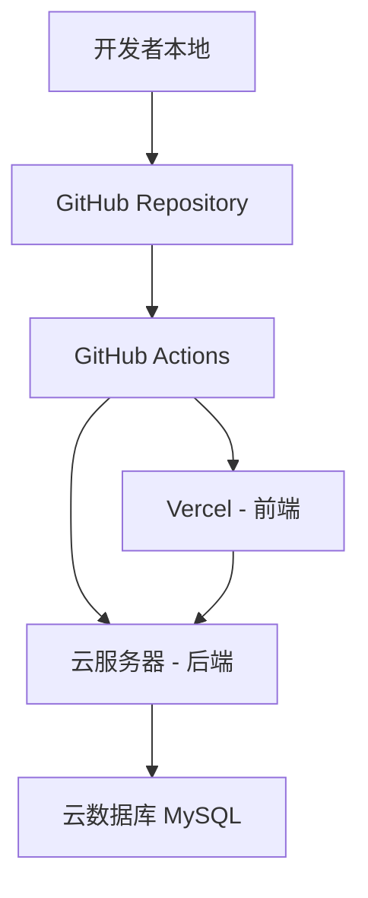
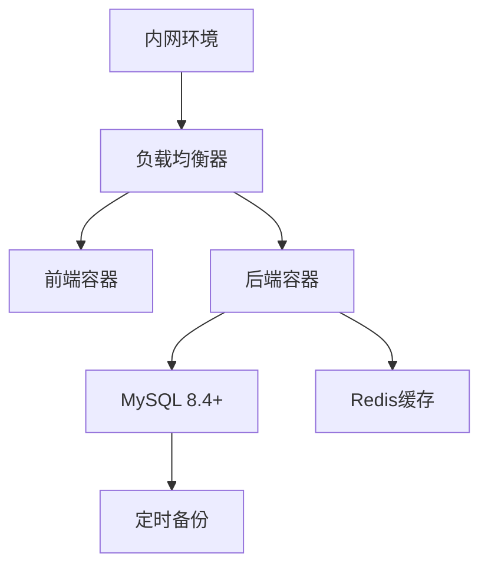

# Pagemaker 架构文档

**版本:** 2.1
**日期:** 2025年6月8日
**作者:** Fred (架构师)

## 1. 技术概要 (Technical Summary)

Pagemaker项目将采用前后端分离的架构模式，在一个Monorepo代码库中进行管理。前端将使用由v0.dev工具链驱动的Next.js技术栈（基于React），后端将采用Python的Django框架。系统通过一套RESTful API进行前后端通信，并使用MySQL 8.4+作为主数据库。项目将采用混合部署模式：开发环境部署于云端（Vercel + 云服务器）以方便调试，生产环境统一部署于内网服务器以保障数据安全。

**架构更新重点:** 基于Epic 0需求，本版本架构文档专注于系统级架构设计、项目基础设施、外部依赖管理和技术风险缓解方案。前端具体实现细节请参考 `frontend-architecture.md`。

## 2. 高层级概览 (High-Level Overview)

* **架构风格:** 前后端分离，通过RESTful API进行有状态的（基于令牌的）通信。
* **代码库结构:** Monorepo，内含独立的 `frontend`、`backend` 和共享的 `packages/types` 目录。
* **后端 (Backend):** Django应用，作为无头CMS，负责提供所有业务逻辑、数据持久化（通过MySQL）、用户认证以及API服务。
* **前端 (Frontend):** Next.js应用，作为Pagemaker CMS的操作界面，负责所有用户界面的渲染和交互，并通过API与后端通信。详细前端架构请参考 `frontend-architecture.md`。
* **外部集成:** 深度集成乐天R-Cabinet API，支持图片/视频上传和管理。
* **开发工具链:** 集成v0.dev工具链进行UI组件快速生成和原型验证。具体集成策略请参考前端架构文档。

## 3. 架构/设计模式 (Architectural / Design Patterns)

* **前后端分离 (Frontend-Backend Separation):** 确保UI逻辑和业务逻辑的独立演进。
* **Monorepo:** 简化个人开发者的项目管理和依赖管理，便于前后端类型共享。
* **RESTful API:** 作为前后端之间清晰、无状态的通信契约。
* **功能性App划分 (Feature-based App Structure for Django):** 将后端按职责（`users`, `pages`, `api`, `media`）划分为内聚的应用，提高可维护性。
* **适配器模式 (Adapter Pattern):** 用于R-Cabinet API集成，提供统一的媒体管理接口。
* **策略模式 (Strategy Pattern):** 用于不同环境下的部署和配置管理。

## 4. 项目基础设施架构 (Project Infrastructure Architecture)

### 4.1 Monorepo工作空间设计

```plaintext
pagemaker-monorepo/
├── .github/                # GitHub Actions工作流
│   └── workflows/
│       ├── ci-frontend.yml
│       ├── ci-backend.yml
│       ├── deploy-dev.yml
│       └── security-scan.yml
├── .ai/                    # AI辅助开发的相关文档
│   ├── requirements-PRD.md
│   └── architecture.md
├── backend/                # Django后端项目
│   ├── api/                # API路由和版本控制
│   ├── users/              # 用户管理应用
│   ├── pages/              # 页面模板管理应用
│   ├── media/              # R-Cabinet集成应用
│   ├── pagemaker/          # Django项目配置
│   ├── requirements.txt    # Python依赖
│   ├── pytest.ini         # 测试配置
│   └── manage.py
├── docs/                   # 项目文档
│   ├── api/                # API文档
│   ├── deployment/         # 部署指南
│   ├── frontend-architecture.md  # 前端架构文档
│   └── development/        # 开发指南
├── frontend/               # Next.js前端项目 (详见frontend-architecture.md)
├── packages/               # 共享代码包
│   └── types/              # 共享TypeScript类型定义
│       ├── api.ts          # API接口类型
│       ├── models.ts       # 数据模型类型
│       └── index.ts        # 导出入口
├── scripts/                # 开发和部署脚本
│   ├── setup-dev.sh       # 开发环境一键设置
│   ├── build-all.sh       # 全项目构建
│   └── deploy-prod.sh     # 生产环境部署
├── docker/                 # Docker配置
│   ├── frontend.Dockerfile
│   ├── backend.Dockerfile
│   └── docker-compose.yml
├── .gitignore
├── .env.example           # 环境变量模板
├── package.json           # 根级workspace配置
└── README.md              # 项目总览和快速开始
```

### 4.2 工作空间管理配置

**根级 package.json 配置:**
```json
{
  "name": "pagemaker-monorepo",
  "private": true,
  "workspaces": [
    "frontend",
    "packages/*"
  ],
  "scripts": {
    "dev": "concurrently \"pnpm run dev:frontend\" \"pnpm run dev:backend\"",
    "dev:frontend": "cd frontend && pnpm dev",
    "dev:backend": "cd backend && python manage.py runserver",
    "build": "pnpm run build:types && pnpm run build:frontend",
    "build:types": "cd packages/types && pnpm build",
    "build:frontend": "cd frontend && pnpm build",
    "test": "pnpm run test:frontend && pnpm run test:backend",
    "test:frontend": "cd frontend && pnpm test",
    "test:backend": "cd backend && pytest",
    "lint": "pnpm run lint:frontend && pnpm run lint:backend",
    "lint:frontend": "cd frontend && pnpm lint",
    "lint:backend": "cd backend && flake8 ."
  }
}
```

## 5. CI/CD管道架构 (CI/CD Pipeline Architecture)

### 5.1 GitHub Actions工作流设计

#### 后端CI工作流 (.github/workflows/ci-backend.yml)
```yaml
name: Backend CI
on:
  push:
    paths: ['backend/**']
  pull_request:
    paths: ['backend/**']

jobs:
  test:
    runs-on: ubuntu-latest
    services:
      mysql:
        image: mysql:8.4
        env:
          MYSQL_ROOT_PASSWORD: test
          MYSQL_DATABASE: pagemaker_test
        options: >-
          --health-cmd="mysqladmin ping"
          --health-interval=10s
          --health-timeout=5s
          --health-retries=3
    steps:
      - uses: actions/checkout@v4
      - uses: actions/setup-python@v4
        with:
          python-version: '3.11'
      - run: pip install -r backend/requirements.txt
      - run: cd backend && flake8 .
      - run: cd backend && python manage.py test
      - run: cd backend && pytest --cov=. --cov-report=xml
```

#### 安全扫描工作流 (.github/workflows/security-scan.yml)
```yaml
name: Security Scan
on:
  push:
    branches: [main, develop]
  schedule:
    - cron: '0 2 * * 1'  # 每周一凌晨2点

jobs:
  security:
    runs-on: ubuntu-latest
    steps:
      - uses: actions/checkout@v4
      - name: Run Snyk to check for vulnerabilities
        uses: snyk/actions/node@master
        env:
          SNYK_TOKEN: ${{ secrets.SNYK_TOKEN }}
      - name: Python Security Check
        run: |
          pip install safety bandit
          cd backend && safety check -r requirements.txt
          cd backend && bandit -r . -f json -o bandit-report.json
```

**注意:** 前端CI/CD配置详见 `frontend-architecture.md` 文档。

### 5.2 部署管道设计

#### 开发环境自动部署
- **前端:** 推送到`develop`分支时自动部署到Vercel（详见前端架构文档）
- **后端:** 推送到`develop`分支时自动构建Docker镜像并部署到开发云服务器
- **数据库:** 开发环境使用云数据库服务（如PlanetScale或AWS RDS）

#### 生产环境部署
- **手动触发:** 通过GitHub Actions手动工作流触发生产部署
- **容器化部署:** 使用Docker Compose在内网服务器上部署
- **数据库迁移:** 自动化Django数据库迁移脚本
- **健康检查:** 部署后自动运行健康检查和烟雾测试

## 6. 外部依赖管理架构 (External Dependencies Management)

### 6.1 乐天R-Cabinet集成架构

#### 集成策略
```python
# backend/media/services/rcabinet_service.py
class RCabinetService:
    """R-Cabinet API集成服务"""
    
    def __init__(self):
        self.api_base = settings.RAKUTEN_RCABINET_API_BASE
        self.auth_token = settings.RAKUTEN_API_TOKEN
        self.timeout = 30  # 30秒超时
        self.retry_attempts = 3
    
    async def upload_image(self, file_data: bytes, filename: str) -> dict:
        """上传图片到R-Cabinet"""
        for attempt in range(self.retry_attempts):
            try:
                # 实现上传逻辑
                return await self._do_upload(file_data, filename)
            except RCabinetAPIError as e:
                if attempt == self.retry_attempts - 1:
                    raise
                await asyncio.sleep(2 ** attempt)  # 指数退避
    
    def health_check(self) -> bool:
        """R-Cabinet服务健康检查"""
        try:
            response = requests.get(f"{self.api_base}/health", timeout=5)
            return response.status_code == 200
        except:
            return False
```

#### 错误处理和降级策略
```python
# backend/media/exceptions.py
class RCabinetAPIError(Exception):
    """R-Cabinet API错误"""
    pass

class RCabinetUnavailableError(RCabinetAPIError):
    """R-Cabinet服务不可用"""
    pass

# backend/media/views.py
class ImageUploadView(APIView):
    def post(self, request):
        try:
            result = rcabinet_service.upload_image(
                request.FILES['image'].read(),
                request.FILES['image'].name
            )
            return Response(result)
        except RCabinetUnavailableError:
            # 降级策略：临时存储到本地
            return self._fallback_local_storage(request.FILES['image'])
        except RCabinetAPIError as e:
            return Response(
                {'error': '图片上传失败，请稍后重试'},
                status=status.HTTP_503_SERVICE_UNAVAILABLE
            )
```

### 6.2 乐天API文档访问策略

#### 文档获取和维护流程
1. **手动文档收集:** 定期登录乐天开发者后台，下载最新API文档
2. **版本控制:** 将API文档存储在`docs/external-apis/rakuten/`目录下
3. **变更监控:** 建立API变更监控机制，及时发现接口变更
4. **测试覆盖:** 为所有R-Cabinet集成点编写集成测试

#### API文档管理结构
```plaintext
docs/external-apis/
└── rakuten/
    ├── rcabinet-api-v1.0.pdf
    ├── api-changes-log.md
    ├── integration-examples/
    └── testing-scenarios.md
```

## 7. 组件视图与应用划分 (Component View & App Division)

后端的Django项目将由以下几个核心应用组成：
* **`users` App:** 负责用户模型、认证（登录/注册）、授权和令牌管理。
* **`pages` App:** 负责`PageTemplate`数据模型、模块化内容（JSON）的CRUD操作和版本控制逻辑。
* **`media` App:** 负责代理与乐天R-Cabinet的交互，主要是图片的上传。
* **`api` App:** 作为API的统一路由层，负责URL结构定义和版本控制（`/api/v1/...`）。

**注意:** 前端功能模块划分详见 `frontend-architecture.md` 文档。

## 8. API参考 (API Reference)

API将以`/api/v1/`为前缀。认证将通过HTTP Header中的Bearer Token（JWT）进行。

### 认证API (`/api/v1/auth/`)
* `POST /login`: 用户登录，成功后返回JWT。
* `GET /me`: 获取当前用户信息。
* `POST /refresh`: 刷新JWT令牌。

### 页面/模板API (`/api/v1/pages/`)
* `GET /`: 获取所有页面/模板的列表（支持分页和筛选）。
* `POST /`: 创建一个新的页面/模板。
* `GET /{id}/`: 获取ID为`{id}`的页面/模板的详细内容。
* `PUT /{id}/`: 更新/保存ID为`{id}`的页面/模板。
* `DELETE /{id}/`: 删除ID为`{id}`的页面/模板。
* `POST /{id}/copy/`: 复制ID为`{id}`的页面/模板。
* `POST /{id}/export/`: 导出页面HTML代码。

### 媒体API (`/api/v1/media/`)
* `POST /images/upload/`: 上传图片到R-Cabinet，成功后返回图片URL。
* `GET /images/`: 获取R-Cabinet中的图片列表。
* `DELETE /images/{id}/`: 删除R-Cabinet中的图片。
* `GET /health/`: R-Cabinet服务健康检查。

### 系统API (`/api/v1/system/`)
* `GET /health/`: 系统健康检查。
* `GET /version/`: 获取系统版本信息。

## 9. 数据模型 (Data Models)

### `users.User` 模型
```python
class User(AbstractUser):
    username = models.CharField(max_length=150, unique=True)
    email = models.EmailField(unique=True, null=True, blank=True)
    is_active = models.BooleanField(default=True)
    date_joined = models.DateTimeField(auto_now_add=True)
    
    # 扩展字段
    preferred_language = models.CharField(
        max_length=10, 
        choices=[('zh', '中文'), ('ja', '日文'), ('en', 'English')],
        default='zh'
    )
    timezone = models.CharField(max_length=50, default='UTC')
```

### `pages.PageTemplate` 模型
```python
class PageTemplate(models.Model):
    name = models.CharField(max_length=200)
    description = models.TextField(blank=True)
    rakuten_target_area = models.CharField(
        max_length=100,
        choices=[
            ('product_description', '商品详情页'),
            ('store_top', '店铺首页'),
            ('category_page', '分类页面'),
            ('campaign_page', '活动页面')
        ]
    )
    content = models.JSONField(default=list)  # 模块化内容的JSON数组
    owner = models.ForeignKey(User, on_delete=models.CASCADE)
    created_at = models.DateTimeField(auto_now_add=True)
    updated_at = models.DateTimeField(auto_now=True)
    
    # 版本控制
    version = models.PositiveIntegerField(default=1)
    is_template = models.BooleanField(default=False)  # 是否为模板
    
    class Meta:
        ordering = ['-updated_at']
        indexes = [
            models.Index(fields=['owner', '-updated_at']),
            models.Index(fields=['rakuten_target_area']),
        ]
```

### `media.MediaFile` 模型
```python
class MediaFile(models.Model):
    MEDIA_TYPES = [
        ('image', '图片'),
        ('video', '视频'),
    ]
    
    name = models.CharField(max_length=200)
    media_type = models.CharField(max_length=10, choices=MEDIA_TYPES)
    rcabinet_url = models.URLField()  # R-Cabinet中的URL
    rcabinet_id = models.CharField(max_length=100)  # R-Cabinet中的ID
    file_size = models.PositiveIntegerField()  # 文件大小（字节）
    mime_type = models.CharField(max_length=100)
    uploaded_by = models.ForeignKey(User, on_delete=models.CASCADE)
    uploaded_at = models.DateTimeField(auto_now_add=True)
    
    class Meta:
        ordering = ['-uploaded_at']
```

## 10. 技术选型表 (Definitive Tech Stack Selections)

| 类别 | 技术 | 版本/细节 | 描述/用途 |
| :--- | :--- | :--- | :--- |
| **语言** | Python | 3.11+ | 后端开发语言 |
| | TypeScript | 5.x+ | 前端开发语言 |
| **框架** | Django | 5.x+ | 后端API框架 |
| | Django REST Framework | 3.14+ | API开发框架 |
| | Next.js | 15.3 | 前端React框架 |
| | Tailwind CSS | 4.1 | 前端CSS框架 |
| | shadcn/ui | 2.6 | 前端UI组件库 |
| **数据库** | MySQL | 8.4+ | 主数据存储 |
| **运行时** | Python | 3.11+ | 后端运行环境 |
| | Node.js | 22.2+ | 前端开发和构建环境 |
| **状态管理** | Zustand | latest | 前端状态管理 |
| **HTTP客户端** | Axios | latest | 前端API请求 |
| **UI生成工具**| v0.dev | N/A | 用于辅助生成前端UI组件 |
| **测试框架**| pytest | latest | 后端单元/集成测试 |
| | pytest-django | latest | Django测试扩展 |
| | Vitest | latest | 前端单元测试 |
| | Playwright | latest | 前端E2E测试 |
| **代码质量**| black | latest | Python代码格式化 |
| | flake8 | latest | Python代码检查 |
| | ESLint | latest | TypeScript代码检查 |
| | Prettier | latest | TypeScript代码格式化 |
| **CI/CD** | GitHub Actions | N/A | 持续集成与部署 |
| **容器化** | Docker | latest | 应用容器化 |
| | Docker Compose | latest | 多容器编排 |
| **监控** | Sentry | latest | 错误监控和性能追踪 |

**注意:** 前端特定技术栈详见 `frontend-architecture.md` 文档。

## 11. 技术风险缓解策略 (Technical Risk Mitigation)

### 11.1 乐天API集成风险缓解

**风险:** R-Cabinet API文档访问困难，集成复杂度高
**缓解策略:**
1. **早期验证:** Epic 0中包含R-Cabinet集成原型（Story 0.8, 0.9）
2. **文档管理:** 建立API文档版本控制和变更监控机制
3. **降级策略:** 实现本地存储备用方案
4. **错误处理:** 完善的重试机制和用户友好的错误提示

**集成测试策略:**
```python
# backend/media/tests/test_rcabinet_integration.py
class RCabinetIntegrationTest(TestCase):
    def test_upload_success(self):
        """测试正常上传流程"""
        pass
    
    def test_upload_failure_retry(self):
        """测试上传失败重试机制"""
        pass
    
    def test_service_unavailable_fallback(self):
        """测试服务不可用时的降级策略"""
        pass
```

### 11.2 数据安全风险缓解

**风险:** 敏感数据泄露，未授权访问
**缓解策略:**
1. **环境隔离:** 开发/生产环境完全隔离
2. **权限控制:** 基于角色的访问控制（RBAC）
3. **数据加密:** 敏感数据传输和存储加密
4. **审计日志:** 完整的操作审计追踪

**安全架构实现:**
```python
# backend/users/permissions.py
class PageTemplatePermission(BasePermission):
    """页面模板权限控制"""
    
    def has_object_permission(self, request, view, obj):
        # 只有所有者可以修改
        if request.method in ['PUT', 'PATCH', 'DELETE']:
            return obj.owner == request.user
        # 所有认证用户可以查看
        return request.user.is_authenticated
```

**注意:** v0.dev工具链和前端性能风险缓解策略详见 `frontend-architecture.md` 文档。

## 12. 部署与DevOps (Infrastructure and Deployment)

### 12.1 开发环境架构



**开发环境配置:**
- **前端:** Vercel自动部署，支持预览分支（详见前端架构文档）
- **后端:** 云服务器Docker部署，支持热重载
- **数据库:** 云数据库服务，自动备份
- **监控:** Sentry错误监控，Vercel Analytics

### 12.2 生产环境架构



**生产环境配置:**
- **部署位置:** 内网服务器，确保数据安全
- **容器化:** Docker + Docker Compose
- **负载均衡:** Nginx反向代理
- **数据库:** MySQL主从复制，定时备份
- **缓存:** Redis缓存层
- **监控:** 内网监控系统，日志聚合

### 12.3 Docker配置

**后端Dockerfile:**
```dockerfile
FROM python:3.11-slim
WORKDIR /app
COPY requirements.txt .
RUN pip install --no-cache-dir -r requirements.txt
COPY . .
RUN python manage.py collectstatic --noinput
EXPOSE 8000
CMD ["gunicorn", "pagemaker.wsgi:application", "--bind", "0.0.0.0:8000"]
```

**注意:** 前端Docker配置详见 `frontend-architecture.md` 文档。

## 13. 编码与安全规范 (Coding & Security Standards)

### 13.1 代码质量标准

**后端 (Python/Django):**
- **格式化:** 强制使用 `black` (行长度88字符)
- **代码检查:** `flake8` + `isort` + `mypy`
- **安全检查:** `bandit` + `safety`
- **测试覆盖率:** ≥ 85%

**注意:** 前端代码质量标准详见 `frontend-architecture.md` 文档。

### 13.2 安全架构

**认证与授权:**
```python
# backend/users/authentication.py
class JWTAuthentication(BaseAuthentication):
    def authenticate(self, request):
        token = self.get_token_from_header(request)
        if not token:
            return None
        
        try:
            payload = jwt.decode(token, settings.SECRET_KEY, algorithms=['HS256'])
            user = User.objects.get(id=payload['user_id'])
            return (user, token)
        except (jwt.InvalidTokenError, User.DoesNotExist):
            raise AuthenticationFailed('Invalid token')
```

**CORS配置:**
```python
# backend/pagemaker/settings.py
CORS_ALLOWED_ORIGINS = [
    "https://pagemaker-frontend.vercel.app",  # 开发环境
    "https://pagemaker.internal.company.com",  # 生产环境
]

CORS_ALLOW_CREDENTIALS = True
```

**环境变量管理:**
```python
# backend/pagemaker/settings.py
import os
from pathlib import Path

# 敏感配置通过环境变量注入
SECRET_KEY = os.environ.get('DJANGO_SECRET_KEY')
DATABASE_PASSWORD = os.environ.get('DB_PASSWORD')
RAKUTEN_API_TOKEN = os.environ.get('RAKUTEN_API_TOKEN')

# 开发环境检查
if not SECRET_KEY and DEBUG:
    raise ImproperlyConfigured('DJANGO_SECRET_KEY environment variable is required')
```

### 13.3 时区处理标准

**UTC标准实现:**
```python
# backend/pagemaker/settings.py
USE_TZ = True
TIME_ZONE = 'UTC'

# 所有模型的时间字段使用UTC
class PageTemplate(models.Model):
    created_at = models.DateTimeField(auto_now_add=True)  # 自动使用UTC
    updated_at = models.DateTimeField(auto_now=True)      # 自动使用UTC
```

**注意:** 前端时区处理详见 `frontend-architecture.md` 文档。

## 14. 国际化架构 (Internationalization Architecture)

### 14.1 后端国际化策略

**后端国际化:**
```python
# backend/pagemaker/settings.py
LANGUAGE_CODE = 'zh-hans'
LANGUAGES = [
    ('zh-hans', '简体中文'),
    ('ja', '日本語'),
    ('en', 'English'),
]

USE_I18N = True
LOCALE_PATHS = [
    BASE_DIR / 'locale',
]
```

**注意:** 前端国际化策略详见 `frontend-architecture.md` 文档。

## 15. 监控与可观测性 (Monitoring & Observability)

### 15.1 应用监控架构

**错误监控:**
```python
# backend/pagemaker/settings.py
import sentry_sdk
from sentry_sdk.integrations.django import DjangoIntegration

sentry_sdk.init(
    dsn=os.environ.get('SENTRY_DSN'),
    integrations=[DjangoIntegration()],
    traces_sample_rate=0.1,
    send_default_pii=True
)
```

### 15.2 健康检查端点

```python
# backend/api/views/health.py
class HealthCheckView(APIView):
    permission_classes = []
    
    def get(self, request):
        checks = {
            'database': self.check_database(),
            'rcabinet': self.check_rcabinet(),
            'cache': self.check_cache(),
        }
        
        all_healthy = all(checks.values())
        status_code = 200 if all_healthy else 503
        
        return Response({
            'status': 'healthy' if all_healthy else 'unhealthy',
            'checks': checks,
            'timestamp': timezone.now().isoformat()
        }, status=status_code)
```

**注意:** 前端监控策略详见 `frontend-architecture.md` 文档。

## 16. 变更日志 (Change Log)

| 版本 | 日期 | 变更描述 | 作者 |
| --- | --- | --- | --- |
| 1.0 | 2025-6-6 | 初始架构文档创建 | Fred |
| 2.0 | 2025-6-8 | 基于Epic 0需求的重大架构更新：<br/>• 新增项目基础设施架构设计<br/>• 完善CI/CD管道架构<br/>• 增强外部依赖管理策略<br/>• 添加v0.dev工具链集成架构<br/>• 补充技术风险缓解策略<br/>• 完善安全架构和监控设计<br/>• 增加国际化和时区处理架构 | Fred |
| 2.1 | 2025-6-8 | 架构文档精简和职责重新划分：<br/>• 移除重复的前端实现细节<br/>• 专注于系统级架构设计<br/>• 修正国际化技术选型错误<br/>• 明确与前端架构文档的边界<br/>• 精简重复的CI/CD和性能优化内容 | Fred |