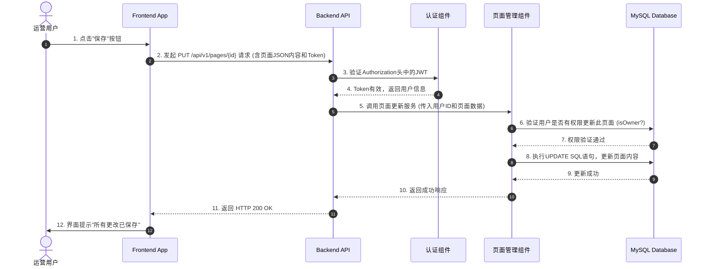
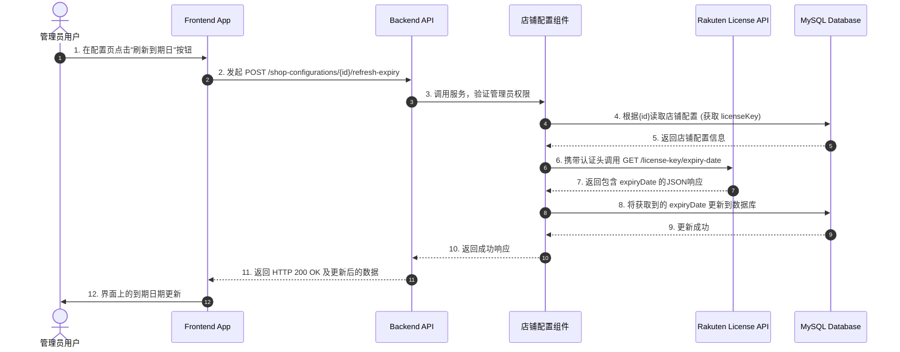

# 核心工作流 (Core Workflows)

## 流程 1: 保存页面内容 (Workflow 1: Saving Page Content)

```mermaid
sequenceDiagram
    autonumber
    actor User as 运营用户
    participant FE as Frontend App
    participant BE as Backend API
    participant Auth as 认证组件
    participant PageSvc as 页面管理组件
    participant DB as MySQL Database

    User->>FE: 1. 点击"保存"按钮
    FE->>BE: 2. 发起 PUT /api/v1/pages/{id} 请求 (含页面JSON内容和Token)
    BE->>Auth: 3. 验证Authorization头中的JWT
    Auth-->>BE: 4. Token有效，返回用户信息
    BE->>PageSvc: 5. 调用页面更新服务 (传入用户ID和页面数据)
    PageSvc->>DB: 6. 验证用户是否有权限更新此页面 (isOwner?)
    DB-->>PageSvc: 7. 权限验证通过
    PageSvc->>DB: 8. 执行UPDATE SQL语句，更新页面内容
    DB-->>PageSvc: 9. 更新成功
    PageSvc-->>BE: 10. 返回成功响应
    BE-->>FE: 11. 返回 HTTP 200 OK
    FE->>User: 12. 界面提示"所有更改已保存"
```

## 流程 2: 刷新API密钥到期日 (Workflow 2: Refreshing API Key Expiry Date)

```mermaid
sequenceDiagram
    autonumber
    actor Admin as 管理员用户
    participant FE as Frontend App
    participant BE as Backend API
    participant CfgSvc as 店铺配置组件
    participant Rakuten as Rakuten License API
    participant DB as MySQL Database

    Admin->>FE: 1. 在配置页点击"刷新到期日"按钮
    FE->>BE: 2. 发起 POST /shop-configurations/{id}/refresh-expiry
    BE->>CfgSvc: 3. 调用服务，验证管理员权限
    CfgSvc->>DB: 4. 根据{id}读取店铺配置 (获取 licenseKey)
    DB-->>CfgSvc: 5. 返回店铺配置信息
    CfgSvc->>Rakuten: 6. 携带认证头调用 GET /license-key/expiry-date
    Rakuten-->>CfgSvc: 7. 返回包含 expiryDate 的JSON响应
    CfgSvc->>DB: 8. 将获取到的 expiryDate 更新到数据库
    DB-->>CfgSvc: 9. 更新成功
    CfgSvc-->>BE: 10. 返回成功响应
    BE-->>FE: 11. 返回 HTTP 200 OK 及更新后的数据
    FE->>Admin: 12. 界面上的到期日期更新
``` 