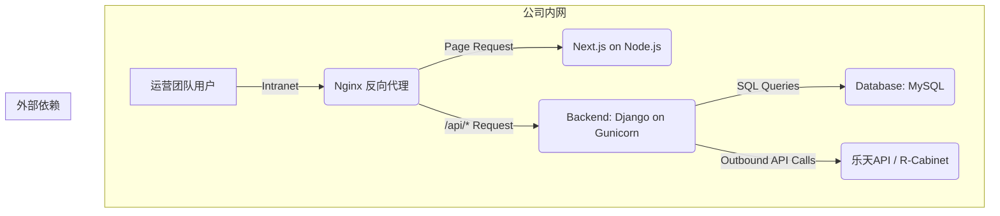

# 高阶架构 (High Level Architecture)

## 2.1 技术摘要 (Technical Summary)

Pagemaker项目将采用现代化的 **前后端分离** 架构。前端将使用 **Next.js** 框架构建，并利用 **v0.dev** 进行UI的初步生成和快速迭代；后端则采用 **Python Django** 框架提供强大的API服务和业务逻辑支持。项目代码将统一管理在 **Monorepo** 代码库中，以提升开发和维护效率。整体架构旨在实现高效开发、关注点分离和未来的可扩展性。

## 2.2 平台与基础设施选择 (Platform and Infrastructure Choice)

* **开发环境 (Development Mode):**
    * **目标:** 快速迭代，实时预览。
    * **前端部署:** 通过 **GitHub Actions 自动部署到 Vercel 平台**。
    * **后端部署:** 公司已购买的**云服务器**。

* **生产环境 (Production Mode):**
    * **目标:** 最大化保障数据安全。
    * **部署平台:** 公司**内网服务器 (On-Premise)**。
    * **前端部署方式:** 在内网服务器上，我们将搭建一个 **Node.js** 运行环境，并通过 **PM2** 等进程管理器来运行Next.js应用。
    * **后端部署方式:** 使用 **Gunicorn** 作为WSGI服务器来运行Django应用。
    * **流量分发与整合:** 为了让前后端在内网中无缝协作，我们将使用 **Nginx** 作为反向代理。Nginx将负责接收所有请求，将针对前端页面的请求转发给Node.js进程，将API请求（如 `/api/*`）转发给Gunicorn/Django进程。

## 2.4 高阶架构图 (High Level Architecture Diagram)

此图仅展示**生产环境**下的架构：

## 2.5 架构模式 (Architectural Patterns)

为确保我们的系统设计清晰、易于维护和扩展，我们将遵循以下核心架构模式：

* **前后端分离 (Frontend-Backend Split)**: 明确分离UI渲染和业务逻辑，允许两端独立开发、部署和扩展。
* **BFF (Backend for Frontend)**: Django后端将作为专门服务于Next.js前端的BFF，提供量身定制的API接口，简化前端数据处理。
* **组件化UI (Component-Based UI)**: 前端将严格遵循组件化的开发模式，利用 `shadcn/ui` 构建可复用、独立的UI单元。
* **仓库模式 (Repository Pattern)**: 在Django后端，我们将采用仓库模式来封装数据访问逻辑，将业务逻辑与数据库操作解耦，便于测试和未来的数据源更换。 