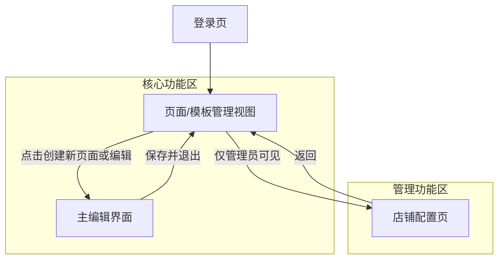
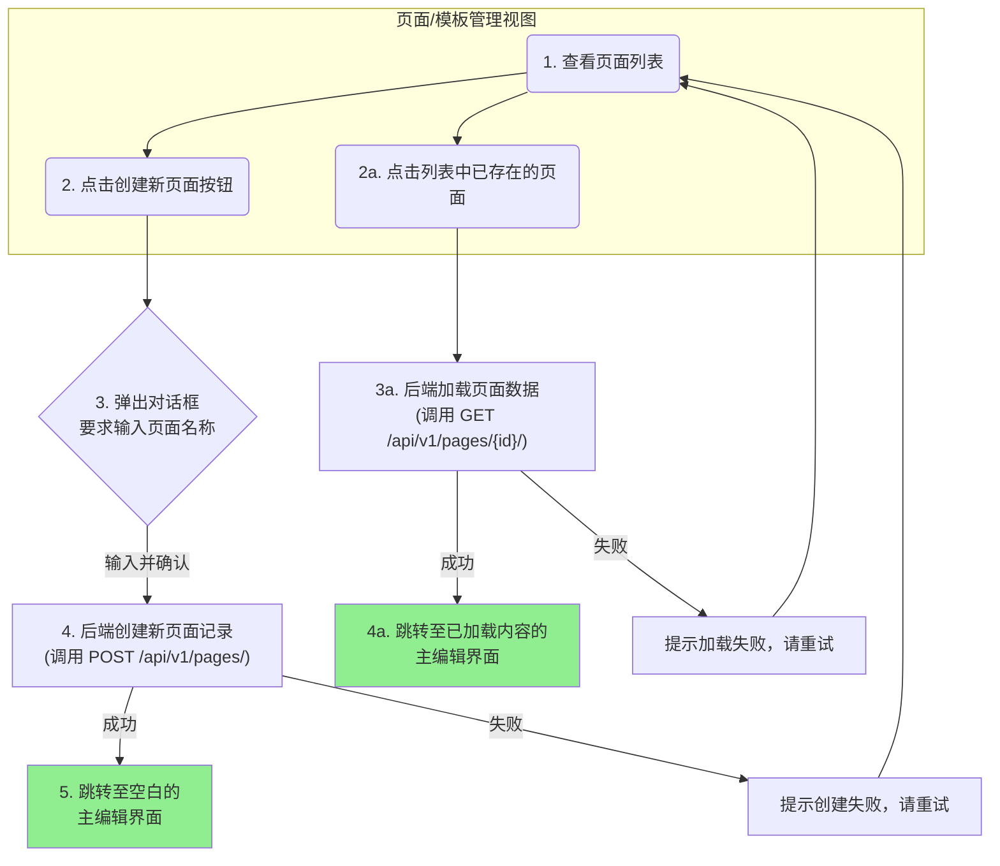
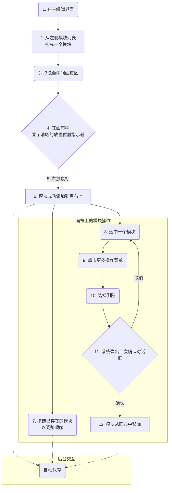
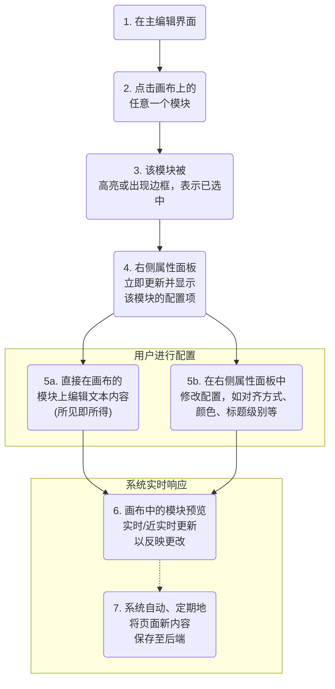
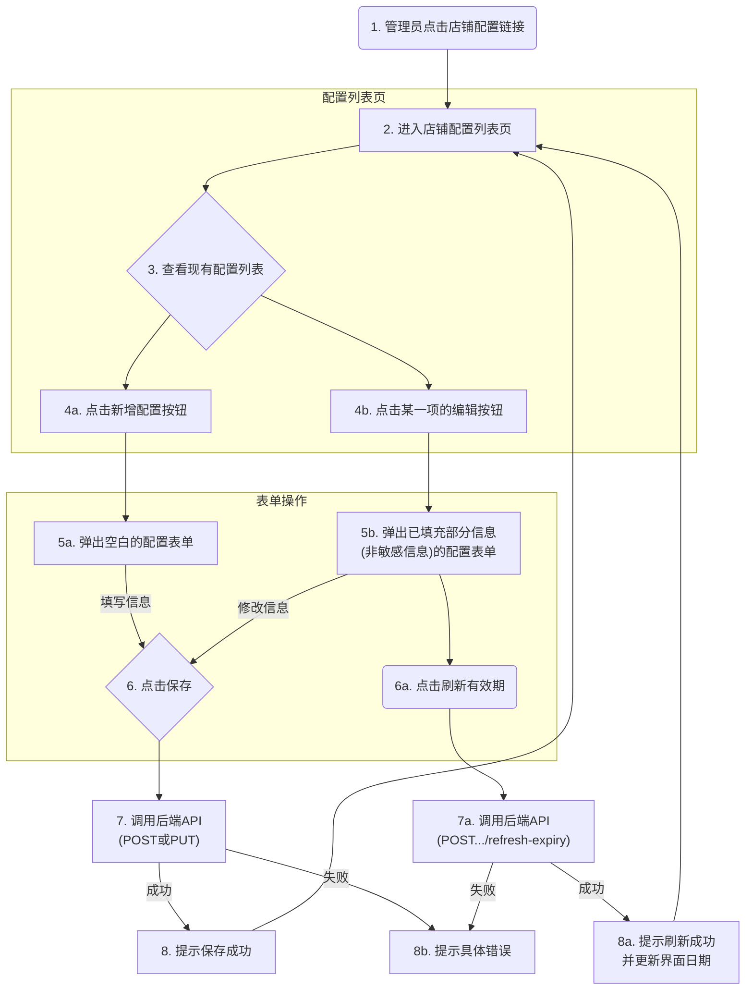

# Pagemaker UI/UX 规格说明

## 第一部分：整体UX目标与设计原则

#### 1. 目标用户画像 (Target User Persona)

* **核心用户**: 乐天店铺的内部运营团队成员。
* **关键特征**:
    * **技术背景**: 普遍不具备编程或HTML知识，但能熟练使用Office、Photoshop等常规办公与设计软件。
    * **工作目标**: 追求效率，需要在快节奏的营销周期内快速响应并制作出高质量的页面。
    * **核心痛点**: 对现有工具的设计自由度不满意，并担忧第三方工具的数据安全问题。

#### 2. 可衡量的可用性目标 (Measurable Usability Goals)

* **快速上手 (Rapid Onboarding)**: 新用户在无外部帮助下，应能在**15分钟内**独立完成一个包含3个基础模块的页面的创建、内容填充与HTML导出。
* **高效流畅 (Efficient Workflow)**: 核心编辑操作（拖拽、配置）的界面响应时间应**低于1秒**。
* **零数据丢失 (Zero Data Loss)**: 通过**自动保存**和**关闭前确认**等机制，确保用户在任何常规操作或意外情况下都不会丢失未保存的工作。

#### 3. 设计原则 (Design Principles)

* **简洁至上，渐进 раскрытие (Simplicity-First with Progressive Disclosure)**: 默认呈现最核心、最高频的功能，保持界面简洁。高级或不常用的功能则收纳在二级菜单或"高级设置"中，在用户需要时才展现。
* **所见即所得 (WYSIWYG)**: 编辑器画布的预览效果应高度忠实于最终生成的页面，为用户提供确定性。
* **状态清晰，反馈及时 (Clear States & Immediate Feedback)**: 用户的每一次操作都应得到即时、清晰的视觉反馈，例如模块的选中、悬停、加载中等状态。
* **为国际化而设计 (Design for Internationalization)**: 界面布局需预留足够空间，以适应不同语言（特别是日文和英文）的文本长度，避免UI错乱。
* **结构化以助AI (Structured for AI)**: 界面和信息组织需清晰、结构化，以便于提炼有效的提示词，辅助AI生成UI。

---

## 第二部分：信息架构 (Information Architecture)

#### 2.1 站点地图 (Site Map)

#### 2.2 导航结构 (Navigation Structure)

* **主导航 (Primary Navigation)**:
    * **无常驻主导航栏**: 登录后，系统将以"页面/模板管理视图"为核心主页或仪表盘。
    * **品牌与用户**: 界面左上角将固定显示Pagemaker的Logo，右上角则提供简单的用户信息及登出选项。
* **上下文操作 (Contextual Actions)**:
    * 用户在不同视图间的跳转，主要通过界面中的按钮和链接来完成。
* **面包屑导航 (Breadcrumbs)**:
    * 在"主编辑界面"时提供简单的面包屑导航，例如： `页面管理 > 我正在编辑的页面标题`。
* **管理员导航 (Admin Navigation)**:
    * 在主界面（例如，侧边栏或用户下拉菜单中）将增加一个名为 "**店铺配置**" 的入口链接。
    * 此链接仅对`admin`角色的用户可见。`editor`角色的用户将看不到此入口。

---

## 第三部分：用户流程 (User Flows)

#### 流程 1: 创建并进入页面编辑 (Flow 1: Create and Enter Page Editor)

* **用户目标**: 作为运营专员，我希望能开始一个新的页面创作，或者打开一个已有的页面进行修改。
* **入口**: 页面/模板管理视图。
* **成功标准**: 用户成功进入一个空白的（用于新页面）或已加载内容的（用于旧页面）编辑器界面。

#### 流程 2: 在画布中添加与操作模块 (Flow 2: Add and Operate Modules on the Canvas)

* **用户目标**: 作为运营专员，我希望能够从模块列表中将内容模块拖拽到编辑区域，并能调整它们的顺序或删除它们，以便灵活地构建页面。
* **入口**: 主编辑界面。
* **成功标准**: 用户能够成功地在画布上添加、移动和删除一个模块，并且画布状态能被自动保存。

#### 流程 3: 配置模块内容与属性 (Flow 3: Configure Module Content and Properties)

* **用户目标**: 作为运营专员，我希望在选中一个模块后，能方便地修改它的文本内容、样式和其它特定选项，并能实时看到修改后的效果。
* **入口**: 在主编辑界面，已选中一个画布上的模块。
* **成功标准**: 用户成功修改模块的属性，画布预览实时更新，并且更改被成功保存。

#### 流程 4: 管理店铺配置 (Flow 4: Managing Shop Configurations)

* **用户/角色 (Actor)**: 管理员 (Admin)
* **用户目标**: 作为管理员，我希望能方便地新增、查看、修改店铺的API和FTP凭据，并能手动刷新API密钥的有效期。
* **入口**: CMS主导航区的"店铺配置"链接。
* **成功标准**: 管理员成功保存或更新了店铺的配置信息，并在界面上得到了明确的成功反馈。

* **边缘情况及错误处理 (Edge Cases & Error Handling)**:
    * 表单验证: 如果用户在表单中输入了无效数据（例如，端口不是数字，必填项为空），应在点击"保存"时，在对应字段旁显示清晰的内联错误提示，阻止提交。
    * API失败: 如果后端API调用失败（例如，因网络问题或无效凭据），应向管理员显示一个明确的、非技术性的错误提示（如："操作失败，请检查您输入的信息或联系技术支持"）。

---

## 第四部分：线框图与核心界面布局 (Wireframes & Key Screen Layouts)

#### 4.1 核心界面线框图 (Key Screen Layouts)

##### 界面 1: 页面/模板管理视图 (Page/Template Management View)
* **用途**: 用户的工作台，用于集中查看、组织、创建和管理所有页面/模板。
* **布局与关键元素**:
    1.  **顶部操作栏**: 左侧为视图标题，右侧为主要的"+ 创建新页面"按钮。
    2.  **侧边栏 (用于组织)**: 提供文件夹或店铺列表，用于筛选或分组。
    3.  **主内容区 - 页面列表**: 以表格形式展示页面，列头包含：`名称`, `类型`, `最后修改日期`，以及`编辑`, `复制`, `删除`的操作。

##### 界面 2: 主编辑界面 (Main Editor Interface)
* **用途**: 用户的核心创作空间，用于搭建、配置和实时预览页面。
* **布局与关键元素**: 采用三栏式布局。
    1.  **左侧栏 - 模块选择面板**: 展示所有可用模块的列表，含名称和图标预览。
    2.  **中间区域 - 可视化编辑画布**: 页面的实时预览和操作区域。
    3.  **右侧栏 - 模块属性配置区**: 上下文感知，显示当前选中模块的配置项。
    4.  **顶部全局操作栏**: 包含面包屑导航、保存状态和"导出HTML"等全局操作。

 ##### **界面 3: 店铺配置页 (Shop Configuration Page)**

 * **用途 (Purpose):**
     此界面仅供管理员使用，用于集中管理所有店铺的API和FTP集成凭据。

 * **布局与关键元素 (Layout & Key Elements):**
     1.  **顶部操作栏 (Header Bar):**
         * 左侧：视图标题，例如“店铺配置管理”。
         * 右侧：一个主要的 **“+ 新增配置”** 按钮。
     2.  **主内容区 - 配置列表 (Main Content - Configuration List):**
         * 以 **表格 (Table)** 的形式展示所有店铺配置。
         * **表格列头**: `店铺名称`, `目标区域`, `API密钥到期日`, `操作`。
         * **表格行操作**: 每一行的“操作”列中，提供`编辑`和`删除`按钮（或收纳在“更多操作”下拉菜单中）。
     3.  **新增/编辑弹窗 (Add/Edit Dialog/Modal):**
         * 点击“新增配置”或“编辑”按钮后，系统会弹出一个模态对话框。
         * **表单字段**: 包含`店铺名称`、`目标区域`、`API Service Secret`、`API License Key`、`FTP主机`、`FTP端口`、`FTP用户`和`FTP密码`的输入框。所有敏感字段都将以密文形式输入。
         * **到期日显示与刷新 (仅编辑模式)**: 在编辑现有配置时，表单会**只读显示**“API密钥到期日”，并在旁边提供一个**“刷新”**按钮，用于触发我们流程4中定义的刷新操作。
         * **操作按钮**: 对话框底部提供“保存”和“取消”按钮。

---

## 第五部分：组件库与设计系统 (Component Library / Design System)

#### 5.1 设计系统方法 (Design System Approach)
* **基础库选型**: 采用 **shadcn/ui** 作为基础组件库。
* **策略**: 将需要的 `shadcn/ui` 组件直接引入项目并进行定制，而不是作为外部依赖使用。
* **v0.dev 集成**: 此方法能确保从AI生成到手动开发的无缝衔接。

#### 5.2 AI辅助生成策略 (AI-Assisted Generation Strategy)
* **严格限定AI生成范围**: 使用 **v0.dev** 的主要目的是快速生成高质量的 **静态UI组件和页面布局**。AI生成的内容将不包含任何后端API调用、数据获取或复杂的状态管理逻辑。

#### 5.3 核心组件清单 (Core Component Inventory)
* **Button**: 用于所有可操作按钮。
* **Table**: 用于"页面管理视图"中展示页面列表。
* **Dialog**: 用于实现"删除页面"前的二次确认弹窗。
* **Input**: 用于创建新页面时输入页面名称。
* **Tooltip**: 用于在图标按钮上提供悬停文字提示。
* **Select / DropdownMenu**: 用于属性面板中的各种选择器。
* **Switch**: 用于属性面板中的开关选项。

---

## 第六部分：品牌与风格指南 (Branding & Style Guide)

#### 6.1 视觉识别 (Visual Identity)
* **Logo**: 已提供。将用于系统左上角。
* **整体风格**: 现代、简洁、专业。

#### 6.2 调色板 (Color Palette)
* **主色 (Primary)**: `#1975B0`
* **辅色 (Secondary)**: `#F2994A`
* **背景色 (Background)**: `#F8F9FA`
* **主要文本 (Text Primary)**: `#1A202C`
* 以及其他标准系统颜色（成功、警告、危险等）。

#### 6.3 字体排印 (Typography)
* **首选字体**: **Inter** (英文/数字)。
* **备用字体**: **Noto Sans SC** (简体中文) 和 **Noto Sans JP** (日文)。
* 已定义从H1到Small的完整字号层级。

#### 6.4 图标系统 (Iconography)
* **图标库**: **Lucide Icons**。
* **使用指南**: 统一尺寸和线条粗细，颜色使用已定义的调色板。

#### 6.5 间距与布局 (Spacing & Layout)
* **间距体系**: 采用 **4像素网格系统 (4-Pixel Grid System)**。

---

## 第七部分：无障碍访问性与响应式策略

#### 7.1 无障碍访问性 (Accessibility)
* **合规目标**: 遵循 **WCAG 2.1 AA** 级别的核心原则。
* **核心要求**: 保证语义化HTML、图片替代文本、键盘可访问性、清晰的焦点状态和颜色对比度。

#### 7.2 响应式策略 (Responsiveness Strategy)
* **断点**: 采用 **Tailwind CSS** 的标准断点系统。
* **自适应模式**:
    * **CMS后台界面**: 主要为桌面端优化，在平板上可用，在移动端做功能简化。
    * **由Pagemaker导出的页面**: 必须完全响应式，确保在任何设备上都有最佳的阅读体验。